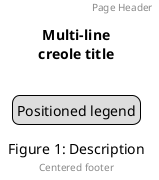
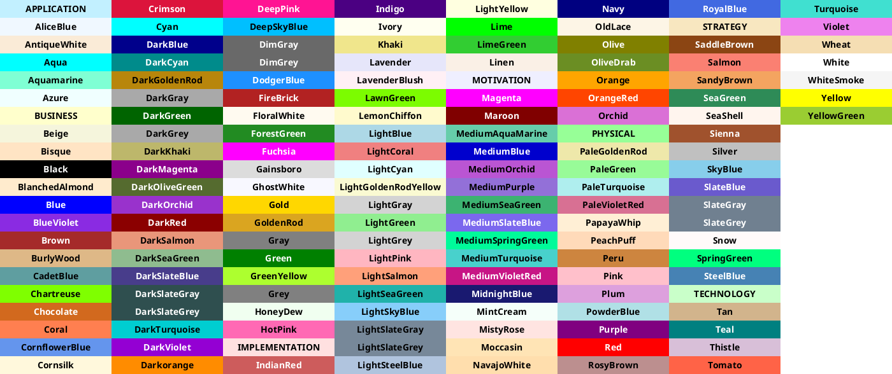

# PlantUML Comprehensive Syntax Reference
**Version: 1.2025.0**

This reference captures the full capabilities and quirks of PlantUML across all diagram types.

---

## Table of Contents
1. [Document Structure](#document-structure)
2. [Common Elements](#common-elements)
3. [Creole Markup](#creole-markup)
4. [Colors](#colors)
5. [Arrow and Relation Syntax](#arrow-and-relation-syntax)
6. [Styling](#styling)
7. [Preprocessing](#preprocessing)
8. [Sprites and Icons](#sprites-and-icons)
9. [Diagram Types](#diagram-types)
10. [Quirks and Workarounds](#quirks-and-workarounds)

---

## Document Structure

### Diagram Delimiters

| Diagram Type | Start | End |
|--------------|-------|-----|
| General UML | `@startuml` | `@enduml` |
| Sequence | `@startuml` | `@enduml` |
| Class | `@startuml` | `@enduml` |
| Activity | `@startuml` | `@enduml` |
| Use Case | `@startuml` | `@enduml` |
| State | `@startuml` | `@enduml` |
| Object | `@startuml` | `@enduml` |
| Component | `@startuml` | `@enduml` |
| Deployment | `@startuml` | `@enduml` |
| Timing | `@startuml` | `@enduml` |
| JSON | `@startjson` | `@endjson` |
| YAML | `@startyaml` | `@endyaml` |
| Salt (Wireframe) | `@startsalt` | `@endsalt` |
| Gantt | `@startgantt` | `@endgantt` |
| MindMap | `@startmindmap` | `@endmindmap` |
| WBS | `@startwbs` | `@endwbs` |

### Sub-diagram IDs

```plantuml
@startuml(id=DIAGRAM_NAME)
...
@enduml
```


---

## Common Elements

### Comments
```plantuml
' Single line comment

/'
Block comment
spanning multiple lines
'/

/' inline block comment '/ code continues
```

### Title, Header, Footer, Caption, Legend


### Mainframe
```plantuml
mainframe This is a **mainframe**
```

### Scale and Zoom
```plantuml
scale 1.5
scale 2/3
scale 200 width
scale 200 height
scale 200*100
scale max 300*200
```

### Newpage (Split Diagrams)
```plantuml
newpage
newpage Title for new page
```

### Diagram Orientation
```plantuml
left to right direction
top to bottom direction    ' default
```

---

## Creole Markup

### Text Formatting

| Style | Creole | HTML |
|-------|--------|------|
| Bold | `**bold**` | `<b>bold</b>` |
| Italic | `//italic//` | `<i>italic</i>` |
| Monospace | `""monospace""` | `<font:monospaced>text</font>` |
| Strikethrough | `--struck--` | `<s>struck</s>` |
| Underline | `__underline__` | `<u>underline</u>` |
| Wave underline | `~~wave~~` | `<w>wave</w>` |

### Escape Character
Use `~` to escape: `~**not bold**`

### Lists
```
* Bullet item
** Nested bullet
# Numbered item
## Nested number
```

### Headings
```
= Extra large
== Large
=== Medium
==== Small
```

### Horizontal Lines
```
----    ' thin line
====    ' double line
____    ' strong line
....    ' dotted line
..Title..  ' dotted with title
```

### Tables
```
|= Header1 |= Header2 |
| Cell1 | Cell2 |
|<#red> Colored | * spans left |
```

### Tree Structure
```
|_ Root
  |_ Child1
  |_ Child2
    |_ Grandchild
```

### Links
```
[[http://url]]
[[http://url Label text]]
[[http://url{Tooltip} Label]]
```

### Code Blocks
```
<code>
function() {
  return true;
}
</code>
```

### HTML Tags
- `<b>`, `<i>`, `<u>`, `<s>`, `<w>`
- `<color:red>text</color>` or `<color:#FF0000>`
- `<back:yellow>background</back>`
- `<size:20>big text</size>`
- `<font:Arial>font name</font>`
- `` or ``
- ``
- `<sub>subscript</sub>`, `<sup>superscript</sup>`

### Unicode and Special Characters
```
<U+221E>        ' Unicode hex
&#8734;         ' Unicode decimal
Direct: ∞       ' Direct unicode
```

### Emoji
```
<:smile:>
<:1f600:>
<#green:sunny:>     ' With color
<#0:sunglasses:>    ' Without color
```

List emoji: `emoji <block>` (blocks: 26, 27, 1F3, 1F4, 1F5, 1F6, 1F9)

### OpenIconic Icons
```
<&icon_name>
<&icon_name*2>      ' Scaled
```

List icons: `listopeniconic`

---

## Colors

### Color Specification
```plantuml
#red                ' Named color
#FF0000             ' RGB hex
#FFFF0000           ' ARGB hex
#RGB(255,0,0)       ' RGB function
transparent         ' Only for backgrounds
```

### Gradient Colors
```plantuml
#red|green          ' Horizontal
#red/green          ' Diagonal /
#red\green          ' Diagonal \
#red-green          ' Vertical
```

### List All Colors


---

## Arrow and Relation Syntax

### Basic Arrows (Sequence Diagrams)
| Arrow | Description |
|-------|-------------|
| `->` | Solid line |
| `-->` | Dotted line |
| `->>` | Thin arrow head |
| `-\` | Upper half arrow |
| `-/` | Lower half arrow |
| `->x` | Lost message (X at end) |
| `x->` | X at start |
| `->o` | Circle at end |
| `o->` | Circle at start |
| `<->` | Bidirectional |

### Arrow Direction Control
| Syntax | Direction |
|--------|-----------|
| `--` | Vertical (long) |
| `-` | Horizontal (short) |
| `-down->` or `-d->` | Down |
| `-up->` or `-u->` | Up |
| `-left->` or `-l->` | Left |
| `-right->` or `-r->` | Right |

### Arrow Color
```plantuml
A -[#red]-> B
A -[#FF0000]-> B
```

### Arrow Style (Bracketed)
```plantuml
A -[bold]-> B
A -[dashed]-> B
A -[dotted]-> B
A -[hidden]-> B
A -[plain]-> B
A -[#red,dashed]-> B
A -[thickness=2]-> B
```

### Class/Object Relations
| Symbol | Meaning |
|--------|---------|
| `<\|--` | Extension (inheritance) |
| `<\|..` | Implementation |
| `*--` | Composition |
| `o--` | Aggregation |
| `-->` | Dependency (solid) |
| `..>` | Dependency (dotted) |
| `--` | Association |
| `..` | Association (dotted) |

### Entity Relationship (IE Notation)
| Symbol | Meaning |
|--------|---------|
| `\|o--` | Zero or one |
| `\|\|--` | Exactly one |
| `}o--` | Zero or many |
| `}\|--` | One or many |

### Cardinality Labels
```plantuml
Class1 "1" *-- "many" Class2 : contains
```

---

## Styling

### Skinparam (Legacy but Supported)

#### Basic Syntax
```plantuml
skinparam backgroundColor #EEEBDC
skinparam handwritten true
skinparam monochrome true
skinparam monochrome reverse     ' For dark backgrounds
skinparam shadowing false
skinparam linetype ortho
skinparam linetype polyline
skinparam RoundCorner 20
skinparam dpi 200
```

#### Nested Syntax
```plantuml
skinparam class {
  BackgroundColor PaleGreen
  BorderColor SpringGreen
  ArrowColor SeaGreen
  FontName Impact
  FontSize 14
  FontColor Black
}
```

#### Stereotype-specific
```plantuml
skinparam class {
  BackgroundColor<<Service>> LightBlue
  BorderColor<<Service>> Blue
}
```

#### Key Parameters
- `*BackgroundColor` - Background
- `*BorderColor` - Border
- `*FontColor`, `*FontName`, `*FontSize`, `*FontStyle`
- `*ArrowColor`, `*ArrowThickness`
- `RoundCorner` - Corner radius
- `defaultFontName`, `defaultFontSize`

List all: `skinparameters` or `help skinparams`

### Style Blocks (Modern)

```plantuml
<style>
classDiagram {
  BackgroundColor white
  class {
    BackgroundColor #E3F2FD
    LineColor #1976D2
    FontColor #0D47A1
    RoundCorner 10
  }
  arrow {
    LineColor #757575
    LineThickness 1
  }
}
</style>
```

#### Available Style Targets by Diagram
- `classDiagram`, `sequenceDiagram`, `stateDiagram`
- `activityDiagram`, `componentDiagram`, `usecaseDiagram`
- `ganttDiagram`, `mindmapDiagram`, `wbsDiagram`
- `jsonDiagram`, `yamlDiagram`, `nwdiagDiagram`
- `timingDiagram`, `saltDiagram`

#### Style Properties
```
BackgroundColor, LineColor, FontColor
FontName, FontSize, FontStyle
LineThickness, LineStyle
RoundCorner, Padding, Margin
HorizontalAlignment, MaximumWidth
Shadowing
```

#### Depth Targeting
```plantuml
<style>
mindmapDiagram {
  :depth(0) { BackgroundColor white }
  :depth(1) { BackgroundColor lightblue }
  :depth(2) { BackgroundColor palegreen }
}
</style>
```

### Inline Styles

#### Element Colors
```plantuml
class Foo #pink
class Bar #palegreen;line:green;line.dashed;text:green
state State1 #red-green ##[dashed]blue
```

#### Full Inline Syntax
`#[color|back:color];header:color;line:color;line.[style];text:color`

---

## Preprocessing

### Variables
```plantuml
!$variable = 42
!$string = "hello"
!$json = { "key": "value" }

' Conditional assignment (only if not defined)
!$name ?= "default"
```

### Conditionals
```plantuml
!if ($variable == 42)
  Alice -> Bob
!elseif ($variable > 10)
  Bob -> Alice
!else
  Charlie -> Alice
!endif
```

### Boolean
- `0` = false, non-zero/any string = true
- Operators: `&&`, `||`, `()`
- Functions: `%true()`, `%false()`, `%not()`, `%boolval()`

### Loops
```plantuml
!while $counter != 0
  :Step $counter;
  !$counter = $counter - 1
!endwhile
```

### Procedures (No Return Value)
```plantuml
!procedure $myproc($arg1, $arg2)
  $arg1 -> $arg2
!endprocedure

$myproc("Alice", "Bob")
```

### Functions (With Return Value)
```plantuml
!function $double($x)
  !return $x * 2
!endfunction

' One-line form
!function $triple($x) !return $x * 3
```

### Default Arguments
```plantuml
!function $greet($name, $greeting="Hello")
  !return $greeting + " " + $name
!endfunction
```

### Unquoted Functions
```plantuml
!unquoted function $id($arg)
  !return $arg
!endfunction
$id(Hello World)    ' No quotes needed
```

### Include Files
```plantuml
!include file.puml
!include file.puml!1           ' Sub-part by index
!include file.puml!DIAGRAM_ID  ' Sub-part by ID
!include https://url/file.puml
!include_many file.puml        ' Allow multiple includes
!include_once file.puml        ' Include only once
```

### Import (Without Inserting)
```plantuml
!import common.puml
```

### Define (Legacy Macros)
```plantuml
!define MACRO_NAME value
!define FUNC($arg) result with $arg
```

### Builtin Functions
| Function | Description |
|----------|-------------|
| `%chr(n)` | Character from codepoint |
| `%darken(color, n)` | Darken color |
| `%lighten(color, n)` | Lighten color |
| `%date(format)` | Current date |
| `%now()` | Current timestamp |
| `%filename()` | Current filename |
| `%dirpath()` | Current directory |
| `%getenv(VAR)` | Environment variable |
| `%intval(s)` | Parse integer |
| `%strlen(s)` | String length |
| `%substr(s, start, len)` | Substring |
| `%strpos(s, needle)` | Find position |
| `%upper(s)`, `%lower(s)` | Case conversion |
| `%newline()` | Newline character |
| `%size(collection)` | Collection size |
| `%splitstr(s, sep)` | Split string |
| `%string(x)` | Convert to string |
| `%str2json(s)` | Parse JSON |
| `%load_json(file)` | Load JSON file |
| `%is_dark(color)` | Check if dark |
| `%is_light(color)` | Check if light |
| `%reverse_color(color)` | Reverse color |
| `%feature(name)` | Check feature support |
| `%version()` | PlantUML version |
| `%random()` | Random number |
| `%file_exists(path)` | Check file |
| `%variable_exists($var)` | Check variable |
| `%function_exists($func)` | Check function |

### Logging and Debugging
```plantuml
!log Debug message: $variable
!assert $x > 0
!dump_memory
```

### Themes
```plantuml
!theme cerulean
!theme blueprint
```

List themes: `help themes`

### Pragmas
```plantuml
!pragma teoz true              ' Enable teoz rendering
!pragma useVerticalIf on       ' Vertical if/else
!pragma layout smetana         ' Use Smetana engine
!pragma useIntermediatePackages false
```

---

## Sprites and Icons

### Defining Sprites
```plantuml
sprite $name {
  FFFFFFFFFFFFFFF
  F0123456789ABCF
  FFFFFFFFFFFFFFF
}
```

### Using Sprites
```plantuml
<$spritename>
<$spritename{scale=2}>
<$spritename,color=red>
<$spritename{scale=2},color=blue>
```

### Encoded Sprites (Compressed)
```plantuml
sprite $name [15x15/8z] NOtH3W0W208HxFz_kMAhj7...
```

Format: `[widthxheight/grayscale_levels][z]`
- Grayscale: 4, 8, or 16
- `z` = compressed

### SVG Sprites
```plantuml
sprite $icon <svg viewBox="0 0 100 100">
  <circle cx="50" cy="50" r="40"/>
</svg>
```

### Standard Library (StdLib)
```plantuml
!include <aws/common>
!include <azure/Compute/AzureVirtualMachine>
!include <logos/docker>
!include <C4/C4_Container>
!include <archimate/Archimate>
```

### Built-in Sprites
```plantuml
sprite $bProcess jar:archimate/business-process
listsprites    ' List available sprites
```

---

## Diagram Types

### Sequence Diagram

#### Participants
```plantuml
participant "Name" as alias
actor Actor
boundary Boundary
control Control
entity Entity
database Database
collections Collections
queue Queue

participant Foo order 10    ' Display order
participant Bar #red        ' Color
```

#### Multiline Participant
```plantuml
participant Foo [
  =Title
  ---""Subtitle""
]
```

#### Messages
```plantuml
Alice -> Bob : message
Alice --> Bob : dotted
Alice ->> Bob : thin arrow
Alice ->x Bob : lost message
Alice <-> Bob : bidirectional
Alice -> Alice : self message
return response    ' Auto-return from activation
```

#### Autonumber
```plantuml
autonumber
autonumber 10
autonumber 10 5          ' start, increment
autonumber "<b>[000]"    ' format
autonumber stop
autonumber resume
autonumber inc A         ' Hierarchical (1.1.1)
```

#### Grouping
```plantuml
alt condition
  ...
else other
  ...
end

opt optional
  ...
end

loop 1000 times
  ...
end

par parallel
  ...
else
  ...
end

break
  ...
end

critical
  ...
end

group Custom Label [Secondary Label]
  ...
end
```

#### Activation
```plantuml
activate Alice
deactivate Alice
destroy Bob

' Shortcut syntax
Alice -> Bob ++ : activate
Bob -> Alice -- : deactivate
Alice -> Bob ** : create
Alice -> Bob !! : destroy

' With color
activate Alice #red
Alice -> Bob ++#blue : hello
```

#### Box
```plantuml
box "Group Name" #LightBlue
  participant Alice
  participant Bob
end box
```

#### Notes
```plantuml
note left: Short note
note right of Alice: Note on participant
note over Alice, Bob: Note over multiple

note left
  Multi-line
  note
end note

hnote over Alice: Hexagonal
rnote over Bob: Rectangle
note across: All participants
/ note over Alice: Aligned with previous
```

#### Reference
```plantuml
ref over Alice, Bob : See other diagram
ref over Bob
  Multi-line
  reference
end ref
```

#### Delay and Space
```plantuml
...
...5 minutes later...
|||
||45||    ' 45 pixels
```

#### Divider
```plantuml
== Initialization ==
```

#### Teoz Features (Parallel Processing)
```plantuml
!pragma teoz true
Alice -> Bob : hello
& Bob -> Charlie : hi     ' Parallel

{start} Alice -> Bob      ' Anchor
{end} Bob -> Alice
{start} <-> {end} : duration
```

#### Slanted Arrows
```plantuml
A ->(10) B : slanted by 10px
A (10)<- B : other direction
```

### Class Diagram

#### Elements
```plantuml
class ClassName
abstract AbstractClass
abstract class AbstractClass
interface InterfaceName
annotation AnnotationName
enum EnumName { VALUE1, VALUE2 }
entity EntityName
exception ExceptionName
metaclass MetaclassName
protocol ProtocolName
struct StructName
circle CircleName
()  circle_short
diamond DiamondName
<>  diamond_short
```

#### Members
```plantuml
class Example {
  -privateField       ' private
  #protectedField     ' protected
  ~packageField       ' package private
  +publicField        ' public

  {static} staticField
  {abstract} abstractMethod()
  {field} forcedField
  {method} forcedMethod

  -- separator --
  .. dotted ..
  == double ==
  __ underline __
}
```

#### Relations
```plantuml
A <|-- B    ' Extension
A <|.. B    ' Implementation
A *-- B     ' Composition
A o-- B     ' Aggregation
A --> B     ' Association
A ..> B     ' Dependency
A -- B      ' Line
A .. B      ' Dotted line

A "1" -- "many" B : label
A -- B : label <    ' Direction indicator
```

#### Generics
```plantuml
class Foo<T extends Element>
```

#### Stereotypes and Spots
```plantuml
class Foo << Stereotype >>
class Bar << (S,#FF0000) Singleton >>
```

#### Packages
```plantuml
package "Name" {
}
package Name <<Node>> { }
package Name <<Rectangle>> { }
package Name <<Folder>> { }
package Name <<Frame>> { }
package Name <<Cloud>> { }
package Name <<Database>> { }
```

#### Namespace
```plantuml
set separator ::
class A::B::C { }

set separator none    ' Disable auto-packages
```

#### Hide/Show/Remove
```plantuml
hide empty members
hide empty fields
hide empty methods
hide members
hide circle
hide stereotype

show ClassName methods
hide <<Stereotype>> circle

hide $tag
remove $tag
restore $tag
hide @unlinked
remove @unlinked
```

#### Lollipop Interface
```plantuml
class Foo
bar ()- Foo
Foo -() bar
```

#### Association Class
```plantuml
Student "0..*" -- "1..*" Course
(Student, Course) .. Enrollment
```

#### Qualified Association
```plantuml
A [qualifier] -- B
```

#### Together (Layout)
```plantuml
together {
  class A
  class B
}
```

#### Extends/Implements Keywords
```plantuml
class A extends B, C
class D implements E
```

### Use Case Diagram

#### Elements
```plantuml
(Use Case)
(Use Case) as (UC)
usecase UC
usecase (Multi\nline) as UC

:Actor:
actor ActorName
:Actor: as A

' Business variants
(Use Case)/
:Actor:/
usecase/ UC
actor/ ActorName
```

#### Relations
```plantuml
User -> (Use)
User --> (Use) : label
(UC1) <|-- (UC2)    ' Extension

(UC1) .> (UC2) : include
(UC2) .> (UC1) : extends
```

#### Actor Styles
```plantuml
skinparam actorStyle awesome
skinparam actorStyle hollow
' Default: stick man
```

### Activity Diagram (New Syntax)

#### Basic Actions
```plantuml
start
:Action;
:Multi-line
action;
stop
end
```

#### Conditionals
```plantuml
if (condition?) then (yes)
  :action;
elseif (other?) then (yes)
  :other;
else (no)
  :default;
endif

' Alternative syntaxes
if (x?) is (value) then
if (x?) equals (value) then
```

#### Vertical If
```plantuml
!pragma useVerticalIf on
```

#### Switch
```plantuml
switch (test?)
case (A)
  :Action A;
case (B)
  :Action B;
endswitch
```

#### Loops
```plantuml
while (condition?)
  :action;
endwhile

while (check?) is (yes)
  :action;
endwhile (no)

repeat
  :action;
repeat while (more?) is (yes) not (no)

repeat :start label;
  :action;
backward :back action;
repeat while (more?)
```

#### Break
```plantuml
repeat
  :action;
  if (done?) then
    break
  endif
repeat while (continue?)
```

#### Fork/Join
```plantuml
fork
  :Action 1;
fork again
  :Action 2;
end fork

end fork {or}
end fork {and}
end merge
```

#### Split
```plantuml
split
  :A;
split again
  :B;
end split
```

#### Kill/Detach
```plantuml
:action;
kill        ' End with X
detach      ' End without connection
```

#### Goto/Label (Experimental)
```plantuml
label myLabel
goto myLabel
```

#### Connectors
```plantuml
(A)
detach
(A)
:continue;
```

#### Swimlanes
```plantuml
|Lane1|
:action;
|#AntiqueWhite|Lane2|
:action;
```

#### Partition/Group
```plantuml
partition "Name" {
  :action;
}

group Groupname
  :action;
end group
```

#### SDL Shapes
```plantuml
:action;    ' Default rectangle
:action|    ' Start/end
:action<    ' Receive
:action>    ' Send
:action/    ' Slant
:action]    ' Document
:action}    ' Database
```

#### Notes
```plantuml
:action;
note right: Note text
floating note left: Floating note
```

#### Arrows
```plantuml
:action;
-> Label;
-[#blue]-> Colored;
-[dashed]-> Style;
-[hidden]-> Hidden;
```

#### Colors
```plantuml
#pink:colored action;
#red/blue:gradient action;
```

### State Diagram

#### States
```plantuml
[*] --> State1        ' Start
State1 --> [*]        ' End
State1 -> State2
State1 : description
state "Long Name" as S1
```

#### Composite States
```plantuml
state Composite {
  [*] --> Inner
  Inner --> [*]
}
```

#### Concurrent States
```plantuml
state Concurrent {
  [*] --> A
  --              ' Horizontal separator
  [*] --> B
  ||              ' Vertical separator
  [*] --> C
}
```

#### Stereotypes
```plantuml
state start <<start>>
state choice <<choice>>
state fork <<fork>>
state join <<join>>
state end <<end>>
state history <<history>>
state deepHistory <<history*>>
state entry <<entryPoint>>
state exit <<exitPoint>>
state input <<inputPin>>
state output <<outputPin>>
```

#### History
```plantuml
State --> [H]      ' History
State --> [H*]     ' Deep history
```

#### Hide Empty Description
```plantuml
hide empty description
```

### Component Diagram

#### Elements
```plantuml
[Component]
[Component] as C
component ComponentName
component [Multi\nline]

() Interface
() "Interface" as I
interface InterfaceName
```

#### Grouping
```plantuml
package "Name" { }
node "Name" { }
folder "Name" { }
frame "Name" { }
cloud "Name" { }
database "Name" { }
```

#### Ports
```plantuml
component C {
  port p1
  portin pi
  portout po
}
```

#### Styles
```plantuml
skinparam componentStyle uml1
skinparam componentStyle uml2       ' Default
skinparam componentStyle rectangle
```

### Deployment Diagram

#### Elements
```plantuml
actor, agent, artifact, boundary, card
circle, cloud, collections, component
control, database, entity, file, folder
frame, hexagon, interface, label, node
package, person, process, queue, rectangle
stack, storage, usecase
```

#### Short Forms
```plantuml
:a:       ' actor
[c]       ' component
()i       ' interface
(u)       ' usecase
```

### Object Diagram

#### Objects
```plantuml
object ObjectName
object "Name" as O

object Obj {
  field1 = "value"
  field2 = 123
}
```

#### Map/Associative Array
```plantuml
map MapName {
  key1 => value1
  key2 => value2
  key3 *-> Object    ' Link to object
}

MapName::key1 --> Other
```

### Timing Diagram

#### Participant Types
```plantuml
robust "Name" as R     ' Complex states
concise "Name" as C    ' Simple states
clock "Name" as CLK with period 50
clock "Name" with period 50 pulse 15 offset 10
binary "Name" as B
analog "Name" as A
```

#### State Changes
```plantuml
@0
R is Idle
C is Waiting

@100
R is Processing
C is Done

@+50              ' Relative time

@2020/07/04       ' Date
@1:15:00          ' Time
```

#### Anchors
```plantuml
@0 as :start
@100 as :end
@:start
@:end
@:start+50
```

#### Participant-Oriented
```plantuml
@R
0 is Idle
+100 is Processing

@C
0 is Waiting
```

#### Messages
```plantuml
A -> B : message
A -> B@+50 : delayed
```

#### Constraints
```plantuml
A@0 <-> @50 : {50ms}
```

#### Highlighting
```plantuml
highlight 100 to 200 #Gold : Caption
```

#### Scale
```plantuml
scale 100 as 50 pixels
```

#### Intricated States
```plantuml
R is {0,1}           ' Undefined between 0 and 1
R is {0,1} #Gray     ' With color
B is {low,high}      ' Binary undefined
```

#### Hidden State
```plantuml
C is {-}         ' Dash placeholder
C is {hidden}    ' Completely hidden
```

#### Date Format
```plantuml
use date format "YY-MM-dd"
```

### Gantt Chart

#### Tasks
```plantuml
[Task Name] requires 10 days
[Task Name] requires 1 week
[Task Name] lasts 5 days
[Task Name] as [T1] requires 10 days
```

#### Start/End
```plantuml
Project starts 2024-01-01
[Task] starts 2024-01-01
[Task] starts D+0
[Task] ends 2024-01-15
[Task] starts 2024-01-01 and ends 2024-01-15
```

#### Dependencies
```plantuml
[Task1] -> [Task2]
[Task2] starts at [Task1]'s end
then [Task3] requires 5 days
```

#### Milestones
```plantuml
[Milestone] happens 2024-01-15
[Milestone] happens at [Task]'s end
```

#### Completion
```plantuml
[Task] is 50% completed
[Task] is 50% complete
```

#### Colors
```plantuml
[Task] is colored in Fuchsia/FireBrick
```

#### Resources
```plantuml
[Task] on {Alice} requires 10 days
[Task] on {Bob:50%} requires 5 days
[Task] on {Alice} {Bob} requires 10 days
{Alice} is off on 2024-01-10 to 2024-01-12
```

#### Closed Days
```plantuml
saturday are closed
sunday are closed
2024-01-01 is closed
2024-01-10 to 2024-01-12 is closed
2024-01-15 is open
```

#### Working Days
```plantuml
[Task] starts 2 working days after [Other]'s end
```

#### Scale
```plantuml
printscale daily
printscale weekly
printscale monthly
printscale quarterly
printscale yearly
printscale daily zoom 2
printscale weekly with calendar date
```

#### Separators
```plantuml
-- Phase 1 --
Separator just at [Task]'s end
```

#### Today
```plantuml
today is 2024-01-15
today is colored in #AAF
today is 30 days after start
```

#### Language
```plantuml
language de
language ja
```

#### Links
```plantuml
[Task] links to [[http://url]]
```

#### Pause
```plantuml
[Task] pauses on 2024-01-10
[Task] pauses on monday
```

#### Delete
```plantuml
[Task] is deleted
```

#### Same Row
```plantuml
[Task2] displays on same row as [Task1]
```

#### Link Colors
```plantuml
[T2] starts 3 days after [T1]'s end with blue dotted link
```

#### Labels
```plantuml
Label on first column and left aligned
Label on last column and right aligned
```

### MindMap

#### OrgMode Syntax
```plantuml
@startmindmap
* Root
** Branch 1
*** Leaf 1.1
*** Leaf 1.2
** Branch 2
@endmindmap
```

#### Arithmetic Notation
```plantuml
+ Right side
++ Sub right
-- Left side
--- Sub left
```

#### Multiline Nodes
```plantuml
*:Multi-line
node content;
```

#### Boxless Nodes
```plantuml
*_ Boxless root
**_ Boxless child
```

#### Colors
```plantuml
*[#Orange] Colored node
**[#lightgreen] Green child
```

#### Direction
```plantuml
left side
right side

top to bottom direction
left to right direction
right to left direction
```

#### Multiroot
```plantuml
* Root1
** Child1
* Root2
** Child2
```

### Work Breakdown Structure (WBS)

#### OrgMode Syntax
```plantuml
@startwbs
* Project
** Phase 1
*** Task 1.1
*** Task 1.2
** Phase 2
@endwbs
```

#### Direction
```plantuml
****< Left child
****> Right child
```

#### Arithmetic Notation
```plantuml
+ Right
++ Sub
-- Left
--- Sub left
```

#### Boxless
```plantuml
+_ Boxless
-_ Also boxless
```

#### Arrows Between Elements
```plantuml
* Root
** "A" as a
** "B" as b
a -> b
```

### Network Diagram (nwdiag)

```plantuml
@startuml
nwdiag {
  network dmz {
    address = "210.x.x.x/24"
    web01 [address = "210.x.x.1"];
    web02 [address = "210.x.x.2"];
  }
  network internal {
    address = "172.x.x.x/24";
    web01 [address = "172.x.x.1"];
    db01 [shape = database];
  }
  group {
    color = "#FFAAAA";
    web01;
    web02;
  }
  inet [shape = cloud];
  inet -- router;
}
@enduml
```

#### Node Shapes
- `node` (default)
- `database`
- `cloud`
- `storage`

### Salt (Wireframe)

#### Basic Widgets
```plantuml
@startsalt
{
  Text
  [Button]
  ()  Radio unchecked
  (X) Radio checked
  []  Checkbox unchecked
  [X] Checkbox checked
  "Text field   "
  ^Dropdown^
}
@endsalt
```

#### Grid Symbols
- `#` - All lines
- `!` - Vertical lines only
- `-` - Horizontal lines only
- `+` - External lines only

#### Separators
```
..    ' Dotted
==    ' Double
~~    ' Wave
--    ' Dashed
```

#### Tree
```plantuml
{T
+ Root
++ Child 1
+++ Grandchild
++ Child 2
}
```

#### Tabs
```plantuml
{/ Tab1 | Tab2 | Tab3 }
```

#### Menu
```plantuml
{* File | Edit | View }
{* File | Edit | View
   View | Zoom | Pan }
```

#### Scrollbars
```plantuml
{S   content }    ' Both
{SI  content }    ' Vertical only
{S-  content }    ' Horizontal only
```

#### Group Box
```plantuml
{^"Title"
  Content
}
```

### JSON Data

```plantuml
@startjson
{
  "key": "value",
  "number": 123,
  "array": [1, 2, 3],
  "nested": {
    "inner": true
  }
}
@endjson
```

#### Highlighting
```
#highlight "key"
#highlight "nested" / "inner"
#highlight "array" / "0"
```

#### Embedding in Other Diagrams
```plantuml
@startuml
allowmixing
class MyClass
json JSON {
  "key": "value"
}
@enduml
```

### YAML Data

```plantuml
@startyaml
key: value
number: 123
list:
  - item1
  - item2
nested:
  inner: true
@endyaml
```

#### Highlighting
```
#highlight "key"
#highlight "nested" / "inner"
```

### ArchiMate

```plantuml
@startuml
!include <archimate/Archimate>

Business_Service(svc, "Service")
Application_Component(comp, "Component")
Rel_Serving(comp, svc, "serves")
@enduml
```

#### Relation Types
- `Rel_Access`, `Rel_Aggregation`, `Rel_Assignment`
- `Rel_Association`, `Rel_Composition`, `Rel_Flow`
- `Rel_Influence`, `Rel_Realization`, `Rel_Serving`
- `Rel_Specialization`, `Rel_Triggering`

#### Directions
- `Rel_*_Up`, `Rel_*_Down`, `Rel_*_Left`, `Rel_*_Right`

---

## Quirks and Workarounds

### General Quirks

1. **Names starting with `$`** cannot be hidden/removed as they're treated as tags
   ```plantuml
   ' Use alias instead
   component [$Name] as myName
   hide myName
   ```

2. **Graphviz layout issues** - Use `skinparam linetype ortho` or `skinparam linetype polyline` for orthogonal lines

3. **Hidden arrows for layout**
   ```plantuml
   A -[hidden]-> B
   ```

4. **IE Diagram crow's feet** look best with `skinparam linetype ortho`

5. **Namespace separator** - Since v1.2023.2, `namespace` and `package` are synonymous

### Sequence Diagram Quirks

1. **Teoz required for certain features**
   ```plantuml
   !pragma teoz true
   ```
   - Nested boxes
   - Parallel messages with `&`
   - Anchors and duration

2. **Note alignment** - Use `/` before note for alignment with previous
   ```plantuml
   note over A : first
   / note over B : aligned
   ```

### Activity Diagram Quirks

1. **Infinite while loop** - Use `-[hidden]->` after `detach`
   ```plantuml
   while (true)
     :action;
   endwhile
   -[hidden]->
   detach
   ```

2. **Vertical if/elseif** requires pragma
   ```plantuml
   !pragma useVerticalIf on
   ```

### Class Diagram Quirks

1. **Methods vs Fields** - Use `{method}` or `{field}` to override auto-detection

2. **Escape visibility markers**
   ```plantuml
   class C {
     \~destructor()   ' Escaped ~
   }
   ```

3. **Note on overloaded methods** - Use full signature
   ```plantuml
   note right of C::"method(int)"
   ```

### State Diagram Quirks

1. **Hide empty description** makes states render as simple boxes

2. **Deep history** syntax: `[H*]` not `[H]*`

### Gantt Quirks

1. **Week duration** - 7 days unless weekends closed, then 5 days

2. **Date relative to today**
   ```plantuml
   !$now = %now()
   Project starts %date("YYYY-MM-dd", $now - 14*24*3600)
   ```

### MindMap/WBS Quirks

1. **Mixed notation** - OrgMode (`*`) and arithmetic (`+`/`-`) can be mixed

2. **Direction markers** - Must immediately follow depth indicator
   ```plantuml
   ****< Left    ' Correct
   **** < Left   ' Wrong
   ```

### JSON/YAML Quirks

1. **Highlighting paths** use `/` separator for nested paths

2. **Style names** differ: `jsonDiagram`, `yamlDiagram`

### Layout Engine Options

```plantuml
!pragma layout smetana    ' Internal engine, no Graphviz needed
```

**Smetana differences:**
- Simple elements before nested (opposite of Graphviz)
- May produce different layouts

---

## Quick Reference Cards

### Arrow Cheat Sheet
```
->    Solid, horizontal
-->   Solid, vertical
->>   Thin head
->o   Circle end
o->   Circle start
->x   X end
<->   Bidirectional
-[#color]->     Colored
-[style]->      Styled (bold/dashed/dotted)
-[hidden]->     Invisible (for layout)
```

### Visibility Markers
```
+  public
-  private
#  protected
~  package
```

### Shape Shortcuts
```
:name:    actor
[name]    component
()name    interface
(name)    use case
```

### Color Specification
```
#red              Named
#FF0000           RGB
#80FF0000         ARGB (with alpha)
#red|green        Gradient horizontal
#red/green        Gradient diagonal
#red-green        Gradient vertical
transparent       Transparent (backgrounds only)
```

### Style Block Template
```plantuml
<style>
diagramType {
  element {
    BackgroundColor #color
    LineColor #color
    FontColor #color
    FontName name
    FontSize number
    RoundCorner number
    LineThickness number
    LineStyle number-number
    Padding number
    Margin number
  }
  arrow {
    LineColor #color
    LineThickness number
  }
}
</style>
```

---

*Document generated from PlantUML 1.2025.0 documentation*
